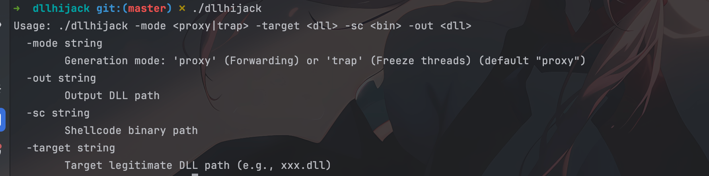
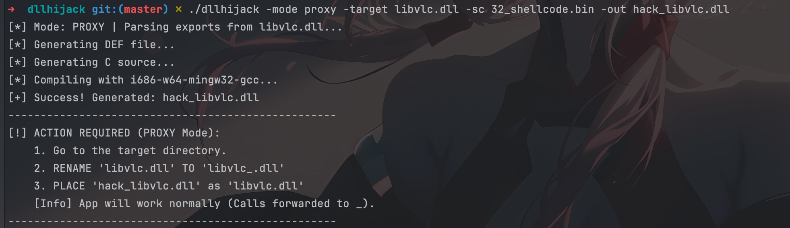

## 1. 简介

一个简单的 dll 注入工具。根据目标 DLL 的导出表，注入 shellcode，生成一个新的 DLL（C 源码 + DEF 文件）。

工具支持两种主要模式：

- **Proxy 模式 (转发模式)**：生成的 DLL 会将所有函数调用转发给原始 DLL，确保目标程序正常运行，同时在后台隐蔽执行 Shellcode。此外，它还包含对 `ExitProcess` 的 Hook 以防止 Shellcode 随主进程退出而意外终止。
- **Trap 模式 (冻结模式)**：强制挂起目标进程中的主线程（除 Shellcode 线程外）， Shellcode 能够独立运行。

## 2. 功能特性

本工具随手一写，仅用于注入，暂未加入反沙箱等措施，实测sliver的加密 shellcode 能运行并全未报毒，后续有时间会加入

- **自动化导出表解析**：自动解析 PE 文件（32位/64位）的导出表，生成对应的 `.def` 文件。
- **多架构支持**：自动检测目标 DLL 是 x86 还是 x64，并调用对应的 MinGW 编译器进行编译。
- **两种加载策略**：
  - `Proxy`：无感注入，保持原有业务逻辑。
  - `Trap`：阻断原有业务，独占进程资源。
- **进程保活机制 (Proxy模式)**：通过 Hook `kernel32!ExitProcess`，将退出调用替换为线程休眠，防止 Shellcode 执行未完成时进程结束。
- **Shellcode 嵌入**：通过 Go `text/template` 动态将二进制 Shellcode 转换为 C 数组嵌入生成的 DLL 中。

## 3. 环境要求

在编译和运行本工具之前，请确保环境满足以下要求：

- **Go 语言环境**：用于编译本生成器工具。
- **MinGW-w64 编译器**：用于将生成的 C 代码编译为 DLL。
  - 需要 `x86_64-w64-mingw32-gcc` (用于 64 位目标)
  - 需要 `i686-w64-mingw32-gcc` (用于 32 位目标)

## 4. 编译本工具

```bash
go build main.go
```

## 5. 使用说明

### 5.1 命令行参数



```
Usage: ./dllhijack -mode <proxy|trap> -target <dll> -sc <bin> -out <dll>

参数说明:
  -mode string
        生成模式: 'proxy' (转发并保活) 或 'trap' (冻结主线程) (默认 "proxy")
  -target string
        目标合法 DLL 的路径 (例如: C:\Windows\System32\version.dll)
  -sc string
        原始 Shellcode 二进制文件路径 (.bin)
  -out string
        输出的恶意 DLL 路径 (例如: version_evil.dll)
```

### 5.2 模式详解

#### A. Proxy 模式

适用于需要隐蔽持久化的场景。

- **原理**：生成的 DLL 包含与目标 DLL 完全一致的导出函数。所有调用会被“转发”到重命名后的原始 DLL。
- **行为**：
  1. 启动 Shellcode 线程。
  2. Hook `ExitProcess` 为无限休眠（防止主程序关闭导致 Shellcode 掉线）。
  3. 正常处理主程序的函数调用。

#### B. Trap 模式

适用于只需执行 Shellcode 且不关心宿主程序稳定性的场景。

- **原理**：不转发函数，导出函数指向一个“黑洞”函数（无限 Sleep）。
- **行为**：
  1. 启动 Shellcode 线程。
  2. 遍历并挂起（Suspend）当前进程内的其他所有线程。
  3. 宿主程序界面将无响应，仅 Shellcode 在运行。

## 6. 操作流程示例

假设我们要劫持一个名为 `libcurl.dll` 的 64 位库，并注入 `beacon.bin`。

### I.生成 DLL

运行以下命令：

```bash
./dllhijack -mode proxy -target libcurl.dll -sc beacon.bin -out libcurl_hook.dll
```

**工具执行过程：**

1. 解析 `libcurl.dll` 导出表。
2. 生成转发定义的 `.def` 文件。
3. 读取 `beacon.bin` 并生成包含 Shellcode 的 `.c` 文件。
4. 调用 `x86_64-w64-mingw32-gcc` 进行编译。

### II. Proxy



Proxy 模式需要原始 DLL 在场以处理转发请求。

1. 进入目标软件目录。
2. 将原始的 `libcurl.dll` 重命名为 `_libcurl.dll`。
3. 将生成的 `libcurl_hook.dll` 重命名为 `libcurl.dll` 并放入该目录。
4. 可自行修改生成的 dll 名

**目录结构变化：**

- **之前**：`libcurl.dll` (合法)
- **之后**：`libcurl.dll` (恶意) + `_libcurl.dll` (合法，被转发)

### III. Trap


Trap 模式不需要原始 DLL。

1. 进入目标软件目录。
2. 备份原始 `libcurl.dll` (可选)。
3. 直接用生成的 DLL 覆盖 `libcurl.dll`。


